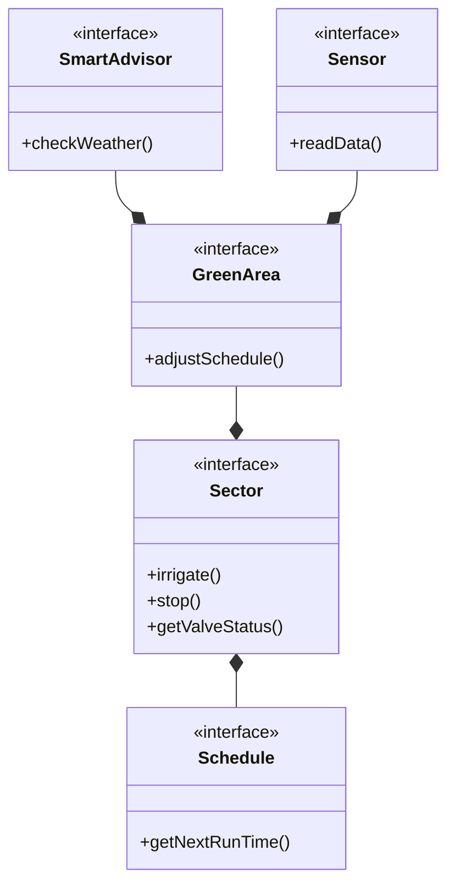

# Relazione SystemGarden

## Abstract
Questo documento è una relazione di meta-livelo che descrive tutti i passaggi logici, concettuali e strutturali dell'applicativo creato di nome "System-Garden".

# Analisi
Ci si pone l'obiettivo di realizzare un gestionale del proprio impianto di irrigazione per la propria Area-Verde.

L'utente potrà: 
-  Visualizzare le informazioni della sua Area-Verde, come le varie fasce orarie di irrigazione da lui impostate e le principali informazioni date da dei sensori.
- Gestire l'irrigazione come tempistiche e fasce orarie, le valvole di apertura o le pompe per mandare in pressione l'acqua.

### Definizione dei termini
- Area-Verde: può essere il Giardino o un gruppo di piante. Ad ogni Area-Verde è associabile una pompa (per mettere in pressione l'acqua) e delle valvolve per aprire determinati settori del Giardino.

### Requisti funzionali
- Gestione di più sistemi di irrigazione.
- Interfaccia UX/UI intuitiva.
- Sistama di messaggi feedback.

### Requisti non funzionali
- Integrazione di telecamere nell'Area-Verde.
- Output sonori.

# Analisi e modello del dominio

Ogni Area-Verde possiede:
- Dei Settori, quindi una o più valvole da aprire e chiudere a seconda della schedule prevista.

