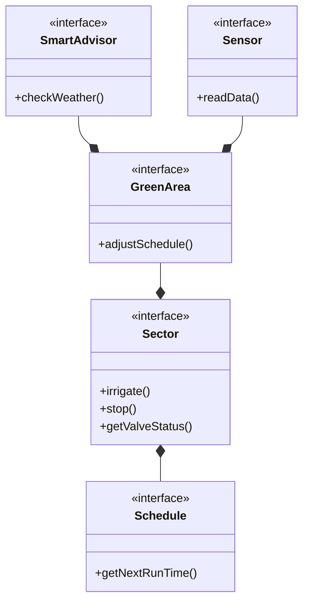

# Relazione SystemGarden

## Abstract
Questo documento è una relazione di meta-livelo che descrive tutti i passaggi logici, concettuali e strutturali dell'applicativo creato di nome "System-Garden".

# Analisi
## Requisiti

Il software, denominato **SystemGarden**, mira alla realizzazione di un sistema gestionale per impianti di irrigazione domestici o professionali. L'obiettivo principale è fornire all'utente uno strumento completo per monitorare e controllare l'irrigazione della propria area verde, integrando funzionalità di automazione.

### Requisiti funzionali

- L'utente deve poter creare e gestire **multiple aree verdi** (giardini, gruppi di piante), ciascuna associata ad una città/località.
- Ogni area verde può contenere **settori di irrigazione** (valvole), gestibili singolarmente con funzionalità di avvio/arresto manuale.
- Deve essere possibile **programmare l'irrigazione automatica** per ogni settore, specificando orario di inizio, durata e giorni della settimana.
- L'utente deve poter aggiungere **sensori** (umidità, temperatura) per monitorare le condizioni ambientali dell'area.
- Deve essere presente un **sistema di notifiche** per informare l'utente su eventi significativi (avvio irrigazione, errori, consigli).
- L'utente deve poter navigare e visionare le sue Aree-Verdi con un **interfaccia semplice ed intuitiva**. 

### Requisiti non funzionali

- L'applicazione deve essere semplice, senza la necessità di **elementi grafici complessi o design avanzato**.
- Il sistema deve permettere l'aggiunta di nuovi tipi di sensori.
- Il sistema deve gestire un numero **limitato di risorse** per ciascuna area verde, consentendo l’associazione di un massimo di 2 sensori e 6 settori di irrigazione per ogni area verde.
- Il sistema deve fornire **raccomandazioni intelligenti** sull'irrigazione basate sui dati dei sensori o, in loro assenza, su dati meteo simulati.

### Definizione dei termini

-   **Area Verde (GreenArea)**: rappresenta un giardino o un gruppo di piante da irrigare. Ad ogni area sono associabili settori, sensori e un advisor.
-   **Settore (Sector)**: zona di irrigazione controllata da una valvola, con possibilità di programmazione temporale.
-   **Sensore (Sensor)**: dispositivo (simulato) che rileva dati ambientali come temperatura o umidità.
-   **Schedule**: programmazione oraria per l'irrigazione automatica di un settore.
-   **SmartAdvisor**: componente che analizza i dati e fornisce raccomandazioni sulla necessità di irrigazione.
-   **WeatherService**: servizio che fornisce dati meteo simulati quando non sono disponibili sensori fisici.

# Analisi e modello del dominio

Ogni Area-Verde possiede:
- Dei Settori, quindi una o più valvole da aprire e chiudere a seconda della schedule prevista.

