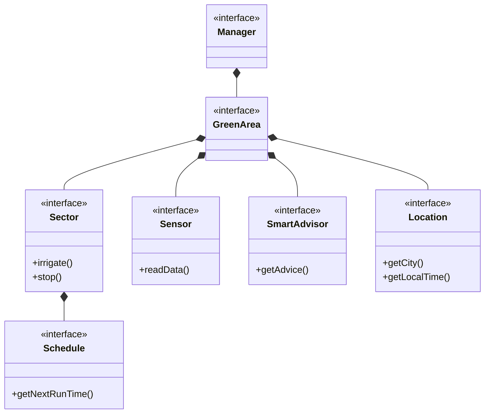
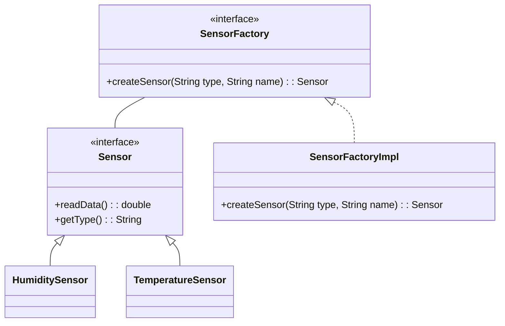
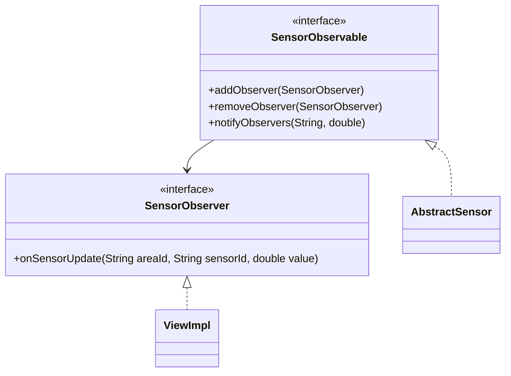
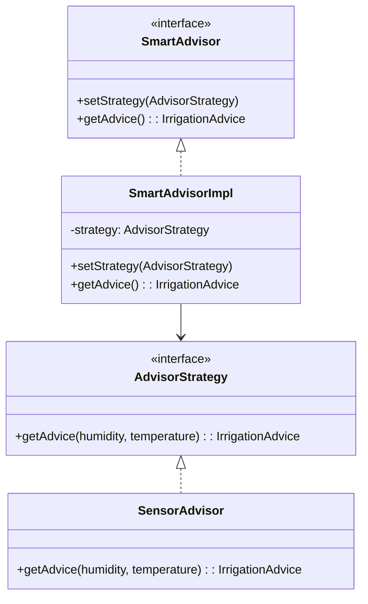
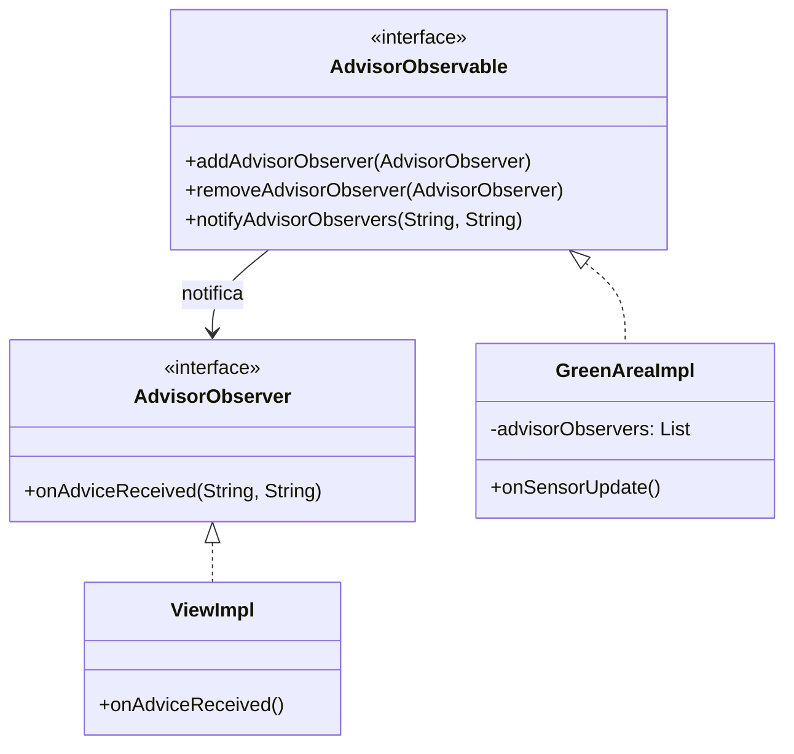

# Relazione SystemGarden

## Abstract
Questo documento è una relazione di meta-livelo che descrive tutti i passaggi logici, concettuali e strutturali dell'applicativo creato di nome "System-Garden".

# Analisi
## Requisiti

Il software, denominato **SystemGarden**, mira alla realizzazione di un sistema gestionale per impianti di irrigazione domestici. L'obiettivo principale è fornire all'utente uno strumento completo per monitorare e controllare l'irrigazione della propria area verde, integrando funzionalità di automazione.


### Requisiti funzionali

- L'utente deve poter creare e gestire **multiple aree verdi**, ciascuna associata ad una città/località.
- Ogni area verde può contenere **settori di irrigazione** (valvole), gestibili singolarmente con funzionalità di avvio/arresto manuale.
- Deve essere possibile **programmare l'irrigazione automatica** per ogni settore, specificando orario di inizio, durata e giorni della settimana.
- L'utente deve poter aggiungere **sensori** (umidità, temperatura) per monitorare le condizioni ambientali dell'area.
- Deve essere presente un **sistema di notifiche** per informare l'utente su eventi significativi di input.
- L'utente deve poter navigare e visionare le sue Aree-Verdi con un interfaccia semplice ed intuitiva. 

### Requisiti non funzionali

- L'applicazione deve essere semplice, senza la necessità di design avanzato.
- Il sistema deve permettere l'aggiunta di nuovi tipi di sensori.
- Il sistema deve differenziare l'area verde tra un giardino o gruppo di piante.

### Definizione dei termini

- **Area-Verde**: rappresenta un giardino o un gruppo di piante da irrigare. Ad ogni area sono associabili settori e sensori.
- **Settore**: zona di irrigazione controllata da una valvola, con possibilità di programmazione temporale.
- **Sensore**: dispositivo (simulato) che rileva dati ambientali come temperatura o umidità.
- **Schedule**: programmazione oraria per l'irrigazione automatica di un settore.
- **SmartAdvisor**: componente opzionale che analizza i dati e fornisce raccomandazioni sulla necessità di irrigazione.
- **Location**: componente che rappresenta la località dell'area verde, utilizzata per il calcolo del fuso orario.


# Analisi e modello del dominio

Il sistema SystemGarden si basa su un modello del dominio che riflette la struttura reale di un impianto di irrigazione. L'entità centrale è Manager che gestisce l'Area-Verde, che a sua volta rappresenta uno spazio fisico da irrigare. Ogni area può contenere: più Settori, che  possono essere attivati manualmente o automaticamente secondo una Programmazione (Schedule), più sensori, che permettono di monitorare le condizioni ambientali, e un SmartAdvisor, che analizza i dati meteo per dare dei consigli di irrigazione.

Inoltre per quanto riguarda alla programmazione oraria si farà riferimento al fuso orario di quell'Area-Verde, quindi ad una Location.




### Principali sfide

- **Creare un'interfaccia semplice e intuitiva**: garantire all'utente un'esperienza chiara e immediata nella gestione dei sistemi.
- **Gestire correttamente le entità legate ai sistemi di irrigazione**: considerando anche località e fuso orario per la programmazione.
- **Sistema di messaggistica**: garantire un buona comprensione del messaggio.
- **Sistema di advisor**: garantire un consiglio efficace per l'utente.
- **Aggiornamento reattivo dei dati**: notificare la view in tempo reale quando i sensori rilevano nuovi valori (simulati) e per la ricezioni di un nuovo consiglio.


# Design
## Architettura

L'architettura adottata segue le regole del pattern **MVC** (Model-View-Controller). In questo caso il modello si sviluppa partendo da `Manager` che funge da entry point per tutto lo stato applicativo del modello.

`GreenArea` è un'interfaccia che viene implementata da `GreenAreaImpl`. In questo modo si può astrarre dall'implementazione dell'Area-Verde e lavorare solo con il contratto d'uso definito, perciò in futuro si potrà implementare diverse versioni di GreenArea.

Sono state modellate diverse entità associate a GreenArea:
- **Sector**: rappresenta una zona irrigabile con propria valvola e programmazione
- **Schedule**: gestice la programmazione di avvio e spegnimento impianto automatico
- **Sensor**: dispositivo per la lettura di dati ambientali
- **SmartAdvisor**: analizza i dati dei sensori e fornisce consigli intelligenti sull'irrigazione
- **Location**: informazioni sulla località per il calcolo del fuso orario

Tutte le entità elencate implementano una propria interfaccia in modo che in futuro, per alcune di esse, si possano implementare versioni differenti.

L'interfaccia grafica viene gestita principalmente della View e dal `MainViewHandler`. Il `MainViewHandler` si occupa di gestire e mostrare le Aree-Verdi visivamente. Seguendo i principi del pattern MVC, la parte "View", a seguito di input dell'utente, contatterà il Controller che poi aggiornerà le varie informazioni, generate o modificate dal Model, tramite i metodi della View.


## Design dettagliato

### Creazione dei sensori
Rappresentazione UML del pattern **Factory Method** per la creazione dei sensori.



#### Problema
Durante lo sviluppo ci sono stati dei problemi nella creazione delle istanze dei sensori, e inoltre
in fase di analisi si era riscontrata la possibilità di aggiungere nuove tipologie di sensori (es. sensore di pioggia, sensore di luce).

#### Soluzione
La soluzione adottata è stata quella di utilizzare il pattern **Factory Method**, in particolare la versione parametrizzata. L'interfaccia `SensorFactory` definisce il contratto d'uso della factory. La classe `SensorFactoryImpl` è responsabile della creazione dei sensori.
Questo pattern semplifica la creazione dei sensori, definendo una classe specifica per questo compito. Ogni tipo di sensore viene creato in base al parametro `type` passato alla factory.


### Notifica aggiornamento sensori
Rappresentazione UML del pattern **Observer** per la notifica dei dati sensori.



#### Problema
Il problema riscontrato è stato quello di notificare alla view quando un sensore ha un nuovo valore. In questo modo la view può visualizzare le informazioni aggiornate per avvisare l'utente.

#### Soluzione
La soluzione adottata è il pattern **Observer**: l'interfaccia `SensorObserver` definisce il metodo di callback `onSensorUpdate`. L'interfaccia `SensorObservable` definisce i metodi per gestire gli observer.
In questo scenario, `AbstractSensor` implementa la logica dell'observable come template e notifica alla `View` (observer) quando ha un nuovo valore.


### Strategia per consigli irrigazione
Rappresentazione UML del pattern **Strategy** per i consigli di irrigazione.



#### Problema
Il sistema deve analizzare i dati dei sensori (temperatura e umidità) per fornire consigli intelligenti sull'irrigazione. In futuro potrebbe essere necessario cambiare l'algoritmo di analisi (ad esempio basandosi su dati meteo invece che sui sensori locali).

#### Soluzione
La soluzione adottata è il pattern **Strategy**: l'interfaccia `AdvisorStrategy` definisce il contratto per gli algoritmi di analisi. `SmartAdvisorImpl` è il "context" che utilizza una strategia configurabile.
Attualmente l'implementazione `SensorAdvisor` analizza umidità e temperatura per determinare se è necessario irrigare. Il pattern permette di aggiungere nuove strategie (es. `WeatherAdvisor`) senza modificare il codice esistente.

Inoltre in futuro si potrebbe anche aggiungere la possbilità di scegliere in autonomia la scelto della strategia (es. se non ho sensori utilizza `WeatherAdvisor`).


### Notifica consigli irrigazione
Rappresentazione UML del pattern **Observer** per la notifica dei consigli dell'Advisor.



#### Problema
Quando lo `SmartAdvisor` genera un nuovo consiglio di irrigazione (basato sui dati dei sensori), la view deve essere notificata per mostrare il consiglio all'utente in tempo reale.

#### Soluzione
La soluzione adottata è nuovamente il pattern **Observer**: l'interfaccia `AdvisorObserver` definisce il metodo di callback `onAdviceReceived`. L'interfaccia `AdvisorObservable` definisce i metodi per gestire gli observer.
In questo scenario, `GreenAreaImpl` implementa `AdvisorObservable` e, quando riceve un aggiornamento dai sensori (`onSensorUpdate`), interroga lo `SmartAdvisor` per ottenere un consiglio e notifica tutti gli observer (in questo caso `ViewImpl`).


## Note di sviluppo

### Utilizzo di Stream per filtrare collezioni
Dove: `it.unibo.systemgarden.model.impl.GreenAreaImpl`

```java
@Override
public Sector getSector( final String sectorId ) {
    return this.sectors.stream()
        .filter( s -> s.getId().equals( sectorId ) )
        .findFirst()
        .orElse( null );
}

```


#### Utilizzo di metodi Generci e Consumer per lambda function
Dove: `it.unibo.systemgarden.view.utils.DialogHelper`

```java
public static<R, C extends DialogController<R>> R showDialog( 
        final String fxmlPath, final String title, final String css, 
        final Consumer<C> controllerInit
    ) {
        
    try {

        final FXMLLoader loader = new FXMLLoader( ClassLoader.getSystemResource( fxmlPath ) );
        final Parent root = loader.load();

        final Stage dialog = createDialogStage( title, root, css );
        final C controller = loader.getController();
        controller.setStage( dialog );

        
        if ( controllerInit != null ) {
            controllerInit.accept( controller );
        }

        dialog.showAndWait();

        return controller.getResult();
    } catch (Exception e) {
        throw new RuntimeException( "Error showing dialog: " + e.getMessage(), e );
    }
}
```

### Utilizzo di ScheduledExecutorService per task periodici
Dove: `it.unibo.systemgarden.controller.impl.ControllerImpl`

```java
@Override
public void start() {
    scheduler = Executors.newSingleThreadScheduledExecutor();
    
    long now = System.currentTimeMillis();
    long delayToNextMinute = 60000 - ( now % 60000 );
    
    scheduler.scheduleAtFixedRate(() -> {
        checkAllSchedules();  
        updateClocks();       
        model.refreshSensorData();  
    }, delayToNextMinute, 60000, TimeUnit.MILLISECONDS);
    
    view.show();
}
```


#### Utilizzo di enumerazioni
Dove: `it.unibo.systemgarden.model.utils.SensorType`
```java
public enum SensorType {
    TEMPERATURE("temperature"),
    HUMIDITY("humidity");

    private final String label;

    SensorType(final String label) {
        this.label = label;
    }

    public String getLabel() {
        return label;
    }

    public String getUnit() {
        switch (this) {
            case TEMPERATURE:
                return "°C";
            case HUMIDITY:
                return "%";
            default:
                return "";
        }
    }

    @Override
    public String toString() {
        return label.substring( 0, 1 ).toUpperCase() + label.substring( 1 );
    }
}
```

### Utilizzo di Platform.runLater per thread-safety JavaFX
Dove: `it.unibo.systemgarden.view.impl.ViewImpl`

```java
@Override
public void onSensorUpdate( final String areaId, final String sensorId, 
    final double newValue, final SensorType type 
) {
    Platform.runLater(() -> mainHandler.refreshSensorData( areaId, sensorId, newValue ));
}
```

### Utilizzo di classi astratte per Template
Dove: `it.unibo.systemgarden.model.impl.sensor.AbstractSensor`

```java
public abstract class AbstractSensor implements Sensor, SensorObservable {

    private final String id;
    private final String name;
    private final List<SensorObserver> observers;
    protected double currentValue;

    @Override
    public void refresh( final String areaId, final SensorType type ) {
        this.currentValue = generateNewValue();  
        notifyObservers(areaId, this.id, this.currentValue, type);
    }

    protected abstract double generateNewValue();
}
```