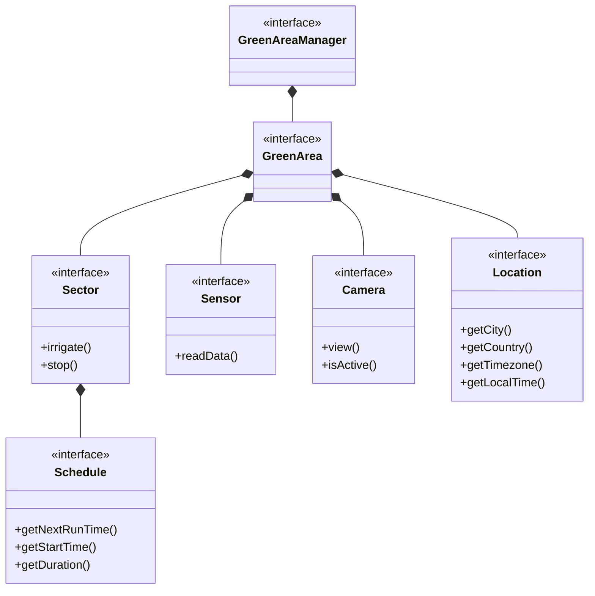

# Relazione SystemGarden

## Abstract
Questo documento è una relazione di meta-livelo che descrive tutti i passaggi logici, concettuali e strutturali dell'applicativo creato di nome "System-Garden".

# Analisi
## Requisiti

Il software, denominato **SystemGarden**, mira alla realizzazione di un sistema gestionale per impianti di irrigazione domestici o professionali. L'obiettivo principale è fornire all'utente uno strumento completo per monitorare e controllare l'irrigazione della propria area verde, integrando funzionalità di automazione.


### Requisiti funzionali

- L'utente deve poter creare e gestire **multiple aree verdi** (giardini, gruppi di piante), ciascuna associata ad una città/località.
- Ogni area verde può contenere **settori di irrigazione** (valvole), gestibili singolarmente con funzionalità di avvio/arresto manuale.
- Deve essere possibile **programmare l'irrigazione automatica** per ogni settore, specificando orario di inizio, durata e giorni della settimana.
- L'utente deve poter aggiungere **sensori** (umidità, temperatura) per monitorare le condizioni ambientali dell'area.
- Deve essere presente un **sistema di notifiche** per informare l'utente su eventi significativi (avvio irrigazione, errori, consigli).
- L'utente deve poter navigare e visionare le sue Aree-Verdi con un **interfaccia semplice ed intuitiva**. 

### Requisiti non funzionali

- L'applicazione deve essere semplice, senza la necessità di **elementi grafici complessi o design avanzato**.
- Il sistema deve permettere l'aggiunta di nuovi tipi di sensori.
- Il sistema deve gestire un numero **limitato di risorse** per ciascuna area verde, consentendo l’associazione di un massimo di 2 sensori e 6 settori di irrigazione per ogni area verde.
- Il sistema deve fornire **raccomandazioni intelligenti** sull'irrigazione basate sui dati dei sensori o, in loro assenza, su dati meteo simulati.

### Definizione dei termini

- **Area-Verde (GreenArea)**: rappresenta un giardino o un gruppo di piante da irrigare. Ad ogni area sono associabili settori e sensori.
- **Settore (Sector)**: zona di irrigazione controllata da una valvola, con possibilità di programmazione temporale.
- **Sensore (Sensor)**: dispositivo (simulato) che rileva dati ambientali come temperatura o umidità.
- **Schedule**: programmazione oraria per l'irrigazione automatica di un settore.
- **SmartAdvisor**: componente opzionale che analizza i dati e fornisce raccomandazioni sulla necessità di irrigazione.
- **WeatherService**: servizio che fornisce dati meteo simulati quando non sono disponibili sensori fisici.


# Analisi e modello del dominio

Il sistema SystemGarden si basa su un modello del dominio che riflette la struttura reale di un impianto di irrigazione. L'entità centrale è l'**Area Verde**, che rappresenta uno spazio fisico da irrigare (un giardino o un gruppo di piante). Ogni area può contenere più **Settori**, ciascuno corrisponde ad una zona controllata da una valvola. I settori possono essere attivati manualmente o automaticamente secondo una **Programmazione** (Schedule).

Per il monitoraggio delle condizioni ambientali, ogni area può essere dotata di **Sensori** che rilevano temperatura e umidità. 

### Principali sfide

- **Creare un'interfaccia semplice e intuitiva**: garantire all'utente un'esperienza chiara e immediata nella gestione dei sistemi.
- **Gestire correttamente le entità legate ai sistemi di irrigazione**: considerando anche località e fuso orario per la programmazione.
- **Sistema di messaggistica**: garantire un buona comprensione del messaggio.





# Design

In questo capitolo si descrivono le strategie messe in campo per soddisfare i requisiti identificati nell'analisi.

## Architettura

L'architettura adottata segue le regole del pattern **MVC** (Model-View-Controller). In questo caso il modello si sviluppa partendo da `Manager` che funge da entry point per tutto lo stato applicativo del modello.

`Manager` è un'interfaccia che viene implementata da `ManagerImpl`. In questo modo si può astrarre dall'implementazione del gestore e lavorare solo con il contratto d'uso definito.

`GreenArea` è un'interfaccia che viene implementata da `GreenAreaImpl`. In questo modo si può astrarre dall'implementazione dell'area verde e lavorare solo con il contratto d'uso definito.

Sono state modellate diverse entità associate a GreenArea:
- **Sector**: rappresenta una zona irrigabile con propria valvola e programmazione
- **Schedule**: gestice la programmazione di avvio e spegnimento impianto automatico
- **Sensor**: dispositivo per la lettura di dati ambientali (temperatura, umidità)
- **Camera**: telecamera per il monitoraggio visivo dell'area
- **Location**: informazioni sulla località per il calcolo del fuso orario

L'interfaccia grafica viene gestita nella parte della "view". Seguendo i principi del pattern MVC, la "view", a seguito di input dell'utente, contatterà il "controller" per ottenere in risposta informazioni generate dal modello.

```
classDiagram

    class Controller {
        <<interface>>
    }

    class View {
        <<interface>>
    }

    class GreenArea {
        <<interface>>
        +addSensor(Sensor)
        +addSector(Sector)
        +addCamera(Camera)
    }

    class GreenAreaManagerImpl {
    }

    class GreenAreaManager {
        <<interface>>
    }

    class Sector {
        <<interface>>
        +irrigate(double)
        +stop()
    }

    class Sensor {
        <<interface>>
        +readData(): double
    }

    class Schedule {
        <<interface>>
        +getNextRunTime(): LocalDateTime
        +getDuration(): int
    }

    class Camera {
        <<interface>>
        +view()
        +getName(): String
        +getLocation(): String
    }

    class Location {
        <<interface>>
        +getCity(): String
        +getCountry(): String
        +getLocalTime(): LocalTime
    }


    GreenAreaManagerImpl --|> GreenAreaManager
    Controller *-- View
    Controller *-- GreenAreaManager
    

    GreenAreaManagerImpl *-- GreenArea
    GreenArea *-- Sensor
    GreenArea *-- Sector
    GreenArea *-- Camera
    GreenArea *-- Location
    
    Sector *-- Schedule
```

## Design dettagliato

### Creazione dei sensori
Rappresentazione UML del pattern **Factory Method** per la creazione dei sensori.


#### Problema
Durante lo sviluppo ci sono stati dei problemi nella creazione delle istanze dei sensori, e inoltre
in fase di analisi si era riscontrata la possibilità di aggiungere nuove tipologie di sensori (es. sensore di pioggia, sensore di luce).

#### Soluzione
La soluzione adottata è stata quella di utilizzare il pattern **Factory Method**, in particolare la versione parametrizzata. L'interfaccia `SensorFactory` definisce il contratto d'uso della factory. La classe `SensorFactoryImpl` è responsabile della creazione dei sensori.
Questo pattern semplifica la creazione dei sensori, definendo una classe specifica per questo compito. Ogni tipo di sensore viene creato in base al parametro `type` passato alla factory.

### Note di sviluppo

#### Utilizzo di Stream per filtrare e operare su collezioni
Dove: `it.unibo.systemgarden.controller.impl`

```java
 @Override
public void irrigateSector( final String areaId, final String sectorId ) {
    final GreenArea area = greenAreas.get( areaId );

    if ( area != null ) {
        area.getSectors().stream().filter(s -> s.getId().equals( sectorId )).findFirst()
        .ifPresent( Sector::irrigate );
        view.refreshAreaCard( area );
    }
}
```


#### Utilizzo di Polimorfismo parametrico e Lambda function (Consumer)
Dove: `it.unibo.systemgarden.view.utils.DialogHelper`

```java
public static<R, C extends DialogController<R>> R showDialog( 
        final String fxmlPath, final String title, final String css, 
        final Consumer<C> controllerInit
    ) {
        
    try {

        final FXMLLoader loader = new FXMLLoader( ClassLoader.getSystemResource( fxmlPath ) );
        final Parent root = loader.load();

        final Stage dialog = createDialogStage( title, root, css );
        final C controller = loader.getController();
        controller.setStage( dialog );

        
        if ( controllerInit != null ) {
            controllerInit.accept( controller );
        }

        dialog.showAndWait();

        return controller.getResult();
    } catch (Exception e) {
        throw new RuntimeException( "Error showing dialog: " + e.getMessage(), e );
    }
}
```